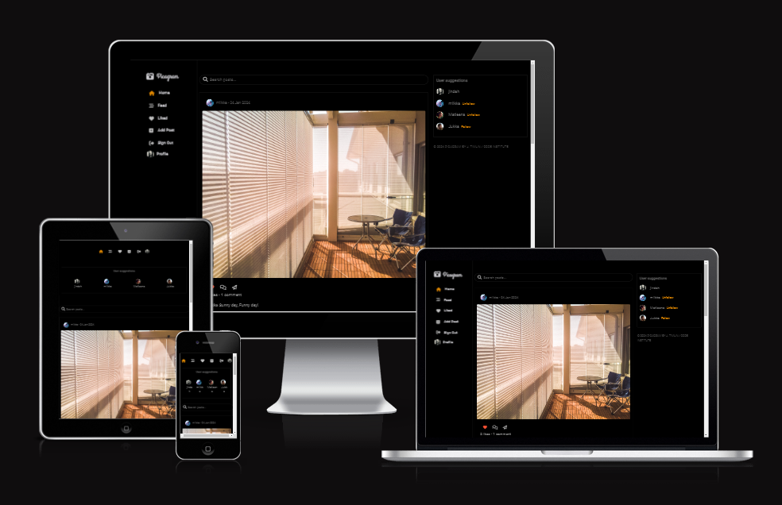
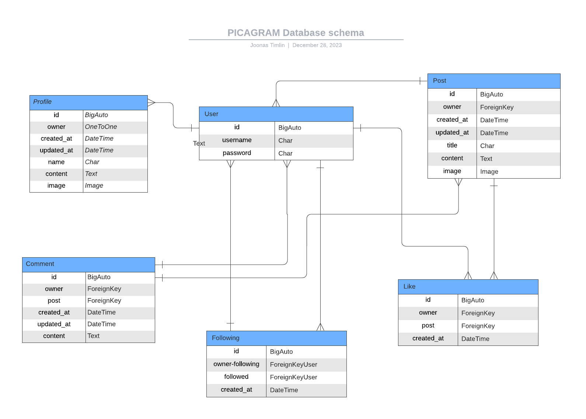

# Picagram

## Introduction

Code Institute Advanced Frontend React Project.

Picagram is a social sharing app designed to provide users with a refined and ad-free experience, reminiscent of Instagram. As a response to the challenges faced by users on existing platforms, Picagram aims to create a space free from intrusive advertising and unwanted bot interactions, focusing solely on genuine social connections and content sharing.

### Live Site

Explore the live site on [Heroku](#).

### Project Stack

Picagram is built using:

Frontend:
React, React-Bootstrap, JSX, CSS, HTML, and axios for handling API requests.

Backend:
Django REST framework with Python.

## Getting Started

To get started with the Picagram app, follow these steps to clone the GitHub repository locally and set up other dependencies:

[Deployment](#deployment)

## Contents

-   [Picagram](#picagram)
    -   [Intro](#intro)
        -   [Live Site](#live-site)
        -   [Project Stack](#project-stack)
        -   [Getting Started](#get-started)
    -   [Design Thinking](#design-thinking)
        -   [Problem ID](#problem-id)
        -   [Problem Statement](#problem-statement)
        -   [Site Goals](#site-goals)
    -   [UX](#ux-user-experience-design)
        -   [User Stories](#user-stories)
            -   [Site Admin](#site-admin)
            -   [User](#user)
            -   [Registered User](#registered-user)
        -   [Wireframe](#wireframe)
        -   [Visual Design](#visual-design)
            -   [Color Scheme](#color-scheme)
            -   [Fonts](#fonts)
            -   [Icons](#icons)
            -   [Logo](#logo)
    -   [Database ERD](#database-erd)
    -   [Development](#deployment)
        -   [Agile Design](#agile-design)
            -   [Github Issues](#github-issues)
                -   [Templates](#templates)
                    -   [User Story Template](#user-story-template)
                    -   [Bug Report](#bug-report)
                    -   [Feature Request](#feature-request)
                -   [Labels](#labels)
            -   [Product Backlog](#product-backlog)
            -   [Iterations](#iterations)
                -   [Backend Iteration](#backend-iteration)
            -   [Kanban Board](#kanban-board)
    -   [Features](#features)
        -   [Current Features](#current-features)
            -   [Landing Page](#landing-page)
            -   [Sign Up Form](#sign-up-form)
            -   [Login Form](#login-form)
            -   [Navbar](#navbar)
            -   [Header](#header)
            -   [Feed Page](#feed-page)
            -   [Liked Page](#liked-page)
            -   [Search Bar](#search-bar)
            -   [Create Post](#create-post-form)
            -   [Edit Post](#edit-post-form)
            -   [Delete Objects](#delete-objects)
            -   [Post Details Page](#post-details-page)
                -   [Likes](#liking)
                -   [Comments](#commenting)
            -   [Profile Page](#profile-page)
                -   [Follow](#follow)
            -   [Update Profile](#update-profile)
        -   [CRUD Functionality](#crud-functionality)
        -   [Future Features](#future-features)
        -   [Reusable Components](#reusable-components)
        -   [InfiniteScroll.js](#infinitescrolljs)
        -   [Loader.js](#loaderjs)
        -   [Avatar.js](#avatarjs)
        -   [MoreModal.js](#morenmodaljs)
        -   [ShareModal.js](#sharemodal.js)
        -   [Post.js](#postjs)
        -   [Comment.js](#commentjs)
        -   [NavBar.js](#navbarjs)
    -   [Contexts/ Hooks](#contexts-hooks)
        -   [CurrentUserContext.js](#currentusercontextjs)
        -   [useRedirectUser.js](#useredirectuserjs)
    -   [Libraries/ Dependencies](#libraries-and-dependencies)
    -   [Testing](testing.md)
    -   [Bugs](#bugs)
        -   [Resolved Bugs](#resolved-bugs)
        -   [Unresolved Bugs](#unresolved-bugs)
    -   [Deployment](#deployment)
        -   [Github Cloning](#github-cloning)
        -   [Heroku Deployment](#heroku-deployment)
    -   [Credits](#credits)
        -   [Tools](#tools)
        -   [Resources](#resources)
        -   [Tutorials](#tutorials)

## Design Thinking

### Problem ID

---

Instagram users often encounter issues with the presence of bots and the overwhelming intrusion of advertising on the platform. These challenges can diminish the overall user experience, leading many to seek alternatives that prioritize genuine interactions and content sharing. Picagram steps in to fill this gap, offering users a platform that values their time and attention.

### Problem Statement

---

"As a user frustrated by the increasing presence of bots and intrusive advertising on Instagram, I am in search of a platform that provides a similar, if not better, social experience without these drawbacks. Picagram emerges as a solution, prioritizing authenticity by eliminating ads and minimizing the interference of bots, ensuring users can enjoy social sharing without distractions."

### Site Goals

---

**User Goals**
- Share moments and updates through visually appealing posts.
- Connect with like-minded individuals on the platform.
- Express creativity and individuality through posts and interactions.

**Owner Goals - Create an inclusive and vibrant social platform where users from diverse backgrounds can:**
- Share their daily lives, activities, and interests.
- Connect with others who appreciate and engage with their content.
- Foster a sense of community through mutual appreciation and connection.

[⏫ contents](#contents)

## UX / User Experience Design

### User Stories

---

#### Site Admin / Developer
- 1. As a site admin, I can control all site content so that I can keep site content safe for all users [User Story 1](https://github.com/jindah/picagram/issues/1)

- 3. As the developer, I want to deploy the backend to Heroku so that it is accessible and functional on the web. [User Story 3](https://github.com/jindah/picagram/issues/3)

#### User 

- 2. As a user, I want to be able to securely access my account and protected resources using JWT authentication. [User Story 2](https://github.com/jindah/picagram/issues/2)

- 4. As a user, I can effortlessly navigate through the site so that my overall experience is frustration-free. [User Story 4](https://github.com/jindah/picagram/issues/4)

- 6. As a user, I can sign in or sign up for an account so that I can enjoy the benefits of a registered user. [User Story 6](https://github.com/jindah/picagram/issues/6)

- 8. As a user, I want to be able to select a post, read its content, and engage with it by commenting and liking. [User Story 8](https://github.com/jindah/picagram/issues/8)

- 11. As a user, I want to view a list of all posts to have an overview of posts and easily select one to view more closely. [User Story 11](https://github.com/jindah/picagram/issues/11)

- 16. As a user, I want to view the "most liked" posts so that I can engage with it. [User Story 16](https://github.com/jindah/picagram/issues/16)

- 17. As a user, I want to actively participate in discussions by commenting on posts. Additionally, as a non-registered user, I want to read comments to follow the conversation. [User Story 17](https://github.com/jindah/picagram/issues/17)

- 18. As a user, I can search each accessible feed to filter the lists of posts. [User Story 18](https://github.com/jindah/picagram/issues/18)

- 23. As a user, I can share posts with others to quickly spread interesting or valuable content. [User Story 23](https://github.com/jindah/picagram/issues/23)

#### Registered User

- 5. As a registered user, I want to be able to manage my account securely by logging in and out. [User Story 5](https://github.com/jindah/picagram/issues/5)

- 7. As a registered user, I want to create and delete my posts effectively within the app. [User Story 7](https://github.com/jindah/picagram/issues/7)

- 10. As a registered user, I want to manage my interaction with other profiles and have a personalized feed, so that I can curate my content experience. [User Story 10](https://github.com/jindah/picagram/issues/10)

- 12. As a registered user, I can click a user's avatar to visit their profile to see their information and posts. [User Story 12](https://github.com/jindah/picagram/issues/12)

- 13. As a registered user, I want to manage my profile, including viewing, updating, and deleting content and information. [User Story 13](https://github.com/jindah/picagram/issues/13)

- 14. As a registered user, I can view the list of 'Most Followed' accounts so that I can discover popular profiles. [User Story 14](https://github.com/jindah/picagram/issues/14)

- 15. As a registered user, I can view a list of all posts I have liked so that I can see my favorite posts. [User Story 15](https://github.com/jindah/picagram/issues/15)

[⏫ contents](#contents)

### Wireframe

---

To aid in the design of the UI a wireframe was created.

[⏫ contents](#contents)

### Visual Design

---

#### Color Scheme

The main colors used throughout the site were:

 
The background color of the site is a deep black (#000), providing a sleek and modern backdrop for the content. This color choice is often associated with elegance and sophistication, enhancing the visual appeal of the platform.

 
The border color for the content section is a slightly lighter shade of black (#202020), creating a subtle separation between different sections. This helps in defining the structure of the content and maintaining a clean layout.

 
The main text color used in the content area is a muted gray (#707070). This choice ensures readability while complementing the dark background. The gray color adds a softer touch to the overall design.

 
The color for hyperlinks is a dark gray (#555555), providing a clear visual cue for clickable elements. This color maintains a balance between visibility and coherence with the overall color scheme.

 
The color for copyright text is a dark gray (#444444). This choice maintains a professional appearance for copyright information while aligning with the overall color palette.

 
Icon Color (#bebebe): Icons are styled with a light gray color (#bebebe). This subtle hue ensures that icons are distinguishable while maintaining a cohesive look with the rest of the design.

 
The background color of the buttons is a warm orange (#df8600), adding a vibrant and attention-grabbing element to the buttons, making them stand out against the darker background. This color choice is associated with energy and enthusiasm, contributing to a positive and engaging user experience.

Additionally, when an icon is hovered over, it transforms to the same warm orange (#df8600). This change in color provides visual feedback, indicating interactivity and adding a vibrant and engaging element to the user interface.

#### Fonts

The fonts chosen for the project were imported from [Google Fonts](https://fonts.google.com/). The primary font used throughout the site is 'Roboto'. Roboto is a versatile sans-serif font known for its readability and adaptability. Whether applied to headings, subheadings, or body text, Roboto maintains clarity and simplicity.

#### Icons

Icons were used throughout the site to assist the user in clarifying different
actions and elements. They are a simple yet very efficient way to convey a
message to the user. I used the [Font Awesome](https://fontawesome.com/)
library.

#### Logo

The logo for the Picagram app features a unique design created using the 'Grand Hotel' font and an icon from Font Awesome named 'fa-camera-retro'. The 'Grand Hotel' font adds a touch of elegance and style to the text, while the camera-retro icon conveys the essence of photography and visual content sharing. The combination creates a distinctive and visually appealing logo that reflects the app's focus on capturing and sharing moments.

[⏫ contents](#contents)

## Database ERD

An entity relationship diagram was created to assist in the visualization of the
database structure. This visualization was important to clarify what data would
be needed in order to provide the functionality desired within the application.
Below is an image of the Created ERD with the relationships between models. A
full rundown of the ERD and the database models within can be found in the
[Picagram-API README/Database ERD](#)

[⏫ contents](#contents)

## Development

### Agile Design

---

Given the scope and diverse features of the Picagram project, adopting an Agile methodology was crucial. The project was bifurcated into frontend and backend components, adding to its intricacy. Managing a project of this magnitude might lead to overlooking or leaving tasks incomplete. With an Agile approach, we could identify key components essential for building the MVP and break them down into more manageable tasks. Each component underwent manual testing to verify its functionality before progressing to the next task. This methodology encourages regular reflection on the project's progress.

#### Github Issues

---

#### Template

Prior to the build process, issue template were created:

-   [User Story](https://github.com/jindah/picagram/blob/main/.github/ISSUE_TEMPLATE/frontend-custom-template.md)

#### Labels

At the beginning of the build after creating the issues, labels also needed to
be created. The first labels created were to assign each template with a front
or backend label, this helped to clearly separate tasks between the two project
repositories. The repository labels:

-   frontend
-   backend

Next prioritising labels were created to define the importance of using the
'MoSCoW' principle, and separate the issues into groups. The labels were used
when assessing each iteration, meaning they were not static from the beginning,
they were reassigned when necessary to adjust the level of importance of the
user story, throughout each iteration in the overall project. The 4 prioritising
labels were:

-   Must Have
-   Should Have
-   Could Have
-   Wont have

To compliment the build process and reach the project MVP within the timeframe,
other labels were created. All bug reports were naturally labeled with 'bug' and
feature requests with the corresponding label. The labels were:

-   Bug
-   Enhancement

#### User Story Template

The first template created was the user story template. Every user story
includes **Acceptance Criteria** and **Tasks**. The purpose of the user story
was to begin the building process and help decide what features would be
potentially included.

-   **Acceptance Criteria**: The acceptance criteria for a user story give a
    clear indication of what the expected outcome for the user is, it contains
    no technical information with regards to completing the user story. However,
    is clearly states what a user would expect in response.

-   **Tasks**: Once the user story was created and the acceptance criteria were
    assigned, the next step was to break it down into smaller tasks, all of
    which were achievable in a day or less. I created the tasks as a checkable
    list, making it visually clear, whilst developing the project, what the next
    step was.

#### Bug Report

Bug reports were made through the issues template, and developers shared information about solving the problems and providing solutions by commenting on them.

[⏫ contents](#contents)

#### Product Backlog

---

When creating new issues, bug reports, or feature requests they were added
directly to the
[Picagram Backlog](https://github.com/users/jindah/projects/5).
Once added to the product backlog it would be assigned the above-mentioned
labels. Throughout the build as iterations were created, issues would be would
be taken from the product backlog and into the relevant iteration, reassigning
the labels according to the specific iteration priorities.

#### Iterations

---

In order to help manage the workload of the project, iterations were implemented
using GitHub milestones to further breakdown the production and provide
incremental delivery.

Working in iterations maintains a steady pace of work and keeps momentum
throughout production. This is due to the constant assessment of progress.

[Project Iterations](https://github.com/jindah/picagram/milestones)

#### Backend Iteration

As the project consisted of two parts a front and backend I felt it was
necessary to include a backend iteration, as the backend would ultimately enable
the front-end functionality.

#### Kanban Board

---

Before starting the production a Kanban board was created using Github Projects.

The board was separated into 6 columns:

-   **Tasks:** the entire product backlog _(all issues)_.
-   **In Progress:** This is actively being worked on.
-   **Bugs:** all issues with bugs found during the testing or development
    stage.
-   **Fixed bugs** Resolved bugs.
-   **Done:** all completed issues.
-   **Future Features** If there wasnt enough time.

During the production the kanban board was constantly revised with issues moving
between columns, this was the main reference point for the development process
and daily tasks. Simply dragging an issue into the 'Done' column marked it as
closed, however, when possible I would close an issue from the terminal using
the `close #<issue number>` command from inside a commit message. This would
automatically move the issue into the 'Done' column.

[Picagram Kanban Board](https://github.com/users/jindah/projects/5)

[⏫ contents](#contents)

## Features

### Current Features

---

### Landing Page

Upon visiting the site, users are greeted with a straightforward navbar offering options such as home, login, and signup. A header provides concise information, encouraging non-registered users to sign up. Below, a feed displays all posts from the site, accompanied by the 'User Suggestions' component, offering non-registered users the opportunity to navigate the site and access information.

[⏫ contents](#contents)

### Sign Up Form

The sign-up registration form is simple, making it easy for unregistered users
to sign-up with just a username and password confirmation. If a registered user
finds themselves on the signup form there is also a login form link at the
bottom to make navigate to the correct form easily.

[⏫ contents](#contents)

### Login Form

Very similar to the signup form is the login form, registered users are able to
login into their account quickly via a simple username and password combination.
For non-registered users, there is a small link to navigate to the correct
sign-up form if they have navigated to the wrong page.

[⏫ contents](#contents)

### Navbar

The navbar found at the left side of the site contains user-related links to parts of
the site. For unregistered and logged-out users the navbar holds links to home,
login, and signup forms. When a registered user is logged in the navbar switches
to contain links to Home, Feed, Add Post, Sign Out and Profile page. It is fully responsive from desktop to mobile collapsing down as the screen size gets smaller. The links in the nav have an active 'className'
set to enable better site navigation for a user and finally the site logo is a
clickable link to the home page.

